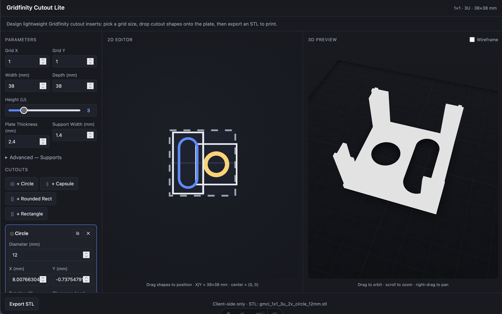

# Gridfinity Cutout Lite

A parametric, browser-based tool for generating lightweight Gridfinity cutout inserts.

> **Live site:** https://jaroslaw-weber.github.io/gridfinity-cutout-lite/

Instead of printing a full custom bin around an object, it creates a thin cutout
plate with integrated minimal corner supports that drops into a standard
Gridfinity bin. Less filament, faster prints, and easy to tweak in millimeters.

<p align="center">
  
</p>

## Features

- **Gridfinity-compatible footprint** — pick a grid size, output a standard bin footprint.
- **Thin top plate** with one or more cutouts positioned via a 2D editor.
- **Built-in cutout shapes** — circle, capsule, rounded rectangle, and rectangle.
- **SVG import** — drop in a custom 2D shape and set its real-world size.
- **Configurable height** in Gridfinity units (1U, 2U, …).
- **Integrated L-shaped corner supports** for stability.
- **Live 3D preview** — orbit, zoom, pan, and toggle a wireframe view.
- **Client-side STL export** — no uploads; the file is generated entirely in the browser.

## Usage

Go from "I need two 11 mm pen holes" to a downloaded STL in under a minute:

1. Pick a grid size and height in Gridfinity units.
2. Add cutout shapes and position them on the 2D plate.
3. Review the footprint in the 3D preview.
4. Click **Export STL** to download a print-ready file.

For custom objects: **Import SVG → set real-world size → set height → export STL**.

## Getting started

```sh
bun install     # or: npm install
bun run dev     # or: npm run dev
```

Open the printed local URL, then:

```sh
bun run build     # production build
bun run preview   # preview the build
bun run typecheck # run the TypeScript/Astro check
```

## Tech stack

- [Astro](https://astro.build/) with the React integration
- [React](https://react.dev/) + [Tailwind CSS](https://tailwindcss.com/)
- [three.js](https://threejs.org/) / [react-three-fiber](https://r3f.docs.pmnd.rs/) for the 3D preview
- [three-stdlib](https://threejs.org/) `STLExporter` for client-side STL export
- [radix-ui](https://www.radix-ui.com/) primitives

## Documentation

Start with the [Overview](docs/1-overview.md).

1. [Overview](docs/1-overview.md)
2. [Default geometry](docs/2-geometry.md)
3. [Main parameters](docs/3-parameters.md)
4. [Cutout system](docs/4-cutouts.md)
5. [SVG import](docs/5-svg-import.md)
6. [2D editor](docs/6-2d-editor.md)
7. [3D preview](docs/7-3d-preview.md)
8. [Geometry generation](docs/8-geometry-generation.md)
9. [Supports](docs/9-supports.md)
10. [Validation](docs/10-validation.md)
11. [Export & project file](docs/11-export.md)
12. [Frontend](docs/12-frontend.md)
13. [MVP](docs/13-mvp.md)

## License

Released under the [MIT License](LICENSE).
